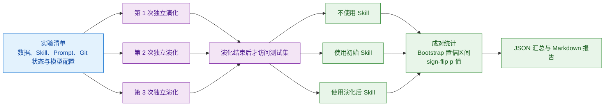

# Skill Learning Engine（Skill 自学习引擎）

[](https://github.com/still0123/skill-learning-engine/actions/workflows/tests.yml)

一个根据任务执行经验持续改进 Skill，并用独立评测验证改动收益的离线学习系统。

它不训练模型参数，而是把 Agent 的成功与失败轨迹沉淀为可复用知识，再生成候选 Skill，
通过验证集门禁后才允许发布。整个过程形成如下闭环：

```text
执行任务 → 保存轨迹 → 提炼知识 → 生成候选 Skill → 独立验证 → 接受或拒绝
```

项目受 [WikiSkill](https://arxiv.org/abs/2608.27454) 启发，但不是论文的官方实现，也不宣称
复现论文中的全部实验结果。模型调用、工具循环和结构化提交复用我实现的
[AgentLoop](https://github.com/still0123/agentloop)，本仓库负责经验学习、Skill 演化、版本门禁
和可复现实验。

## 为什么需要它

传统 Skill 通常由开发者手工维护：发现失败、阅读日志、总结经验、修改说明文件。这样做有
三个明显问题：

- 执行经验散落在日志里，后续任务无法直接复用。
- Skill 修改依赖个人判断，难以解释为什么这样改。
- 修改后缺少独立评测，无法确认是真正提升还是偶然波动。

Skill Learning Engine 将这些工作拆成三个相互隔离的层次：

- 原始轨迹（Raw）：保存每次执行的不可变证据，回答“发生了什么”。
- 知识库（Wiki）：从成功与失败样本中提炼通用模式，回答“学到了什么”。
- 正式 Skill（Skills）：只接收通过验证门禁的修改，回答“哪些经验可以正式生效”。

## 工作原理

```mermaid
flowchart LR
    TASK["训练任务"] --> EXEC["任务执行器<br/>使用当前 Skill 执行"]
    EXEC --> RAW["原始轨迹<br/>保存输入、输出与过程"]
    RAW --> MAINTAIN["知识维护者<br/>归纳成功与失败模式"]
    MAINTAIN --> WIKI["持久知识库<br/>模式与证据索引"]
    WIKI --> PROPOSE["Skill 提案器<br/>生成一次原子修改"]
    ACTIVE["当前正式 Skill"] --> PROPOSE
    PROPOSE --> CANDIDATE["候选 Skill<br/>在隔离目录中构建"]
    CANDIDATE --> VALIDATE["验证集评测"]
    VALIDATE --> GATE{"分数是否严格提升？"}
    GATE -->|是| PROMOTE["保存旧版本并发布候选"]
    GATE -->|否| REJECT["拒绝候选<br/>正式版本保持不变"]
    PROMOTE --> IMPACT["Skill 影响记录"]
    REJECT --> IMPACT

    classDef evidence fill:#E3F2FD,stroke:#1976D2,color:#0D47A1
    classDef knowledge fill:#F3E5F5,stroke:#7B1FA2,color:#4A148C
    classDef skill fill:#E8F5E9,stroke:#388E3C,color:#1B5E20
    classDef gate fill:#FFF3E0,stroke:#EF6C00,color:#E65100
    class RAW evidence
    class MAINTAIN,WIKI knowledge
    class ACTIVE,CANDIDATE,PROMOTE skill
    class VALIDATE,GATE,REJECT,IMPACT gate
```



其中只有三个环节需要大模型参与：

- 任务执行器：根据任务和当前 Skill 生成答案。
- 知识维护者：从训练轨迹中提炼可复用的成功策略和失败模式。
- Skill 提案器：根据知识与证据生成一次可审查的文本修改。

候选隔离、评分计算、版本晋级和拒绝回滚均由确定性 Python 代码控制。大模型不能直接修改
正式 Skill，也不能自行决定候选是否发布。

## 核心设计

| 机制 | 实现方式 | 解决的问题 |
|---|---|---|
| 最小权限运行时 | 按角色分配 `read_file`、`glob`、`submit_result` | 限制模型可见信息和副作用 |
| 严格结构化输出 | 必须调用一次 `submit_result` 并通过 Schema 校验 | 防止自然语言输出污染流程 |
| 原子修改 | 每轮只允许一次精确文本替换，原文必须唯一命中 | 让 Skill 变化可解释、可审查 |
| 成对验证门禁 | 候选与当前最佳版本在同一组 Validation task ID 上比较 | 避免任务错位和无收益修改 |
| 版本快照 | 发布前保存正式 Skill，拒绝或异常时保持原版本 | 便于审计和恢复 |
| Test 隔离 | 所有演化结束后才访问 Test | 防止测试集参与版本选择 |
| 三条件对照 | 比较无 Skill、初始 Skill、演化后 Skill | 拆分模型能力、人工 Skill 收益和演化增量 |
| 可复现实验 | 快照数据、Prompt、Skill，并记录 Git 状态和模型可见配置 | 让实验结果可以追溯和复核 |
| 成对统计 | Bootstrap 置信区间与 sign-flip p 值 | 避免只看一次平均分 |

更完整的约束与验收标准见 [V1 设计文档](docs/spec.md) 和
[V2 设计文档](docs/spec-v2.md)。

## 实验如何避免“看起来有效”

每次正式实验会创建多个相互独立的工作区。演化阶段只使用 Train 和 Validation；全部迭代
结束后，才在相同的 Test 任务上依次评测三种条件：

1. `no_skill`：不向执行模型提供 Skill 名称、版本或内容。
2. `seed_skill`：使用实验开始时的人工初始 Skill。
3. `evolved_skill`：使用最终通过验证门禁的 Skill。



重复运行不会被错误地当成更多独立样本：系统先对同一 Test task 的重复结果取均值，再按唯一
task ID 执行成对 Bootstrap。p 值由零效应假设下的 paired sign-flip randomization test
计算；少于 10 个唯一 Test task 时，报告不会标记为“统计显著提升”。

## 角色隔离

三个模型角色不会共享同一文件视图：

- 任务执行器只能提交答案，无法读取工作区文件，也看不到评分标签。
- 知识维护者只接收抽样后的 Train 轨迹，不接触 Validation 或 Test 数据。
- Skill 提案器只能访问当轮生成的最小视图，其中仅包含 Wiki、当前 Skill、影响记录和
  本轮 Train 轨迹。

评分、候选接受和版本发布始终由外层确定性代码完成。

## 快速开始

需要 Python 3.10 或更高版本。

```bash
git clone https://github.com/still0123/skill-learning-engine.git
cd skill-learning-engine
python3.11 -m venv .venv
source .venv/bin/activate
pip install -e ".[dev]"
```

### 运行离线演示

下面的命令不会访问模型 API，也不会产生费用：

```bash
skill-learning demo --workspace ./demo-workspace
```

演示从“原样返回输入”的 Skill 出发，根据大小写和首尾空格导致的失败轨迹生成知识，提出
“转为小写并去除首尾空格”的候选修改，并在 Validation 分数由 0 提升到 1 后发布为 v1。

该结果只用于验证编排、门禁与版本管理是否正常，不代表真实模型效果。

### 运行完整离线实验流程

```bash
make experiment-demo
```

该命令会生成三条件对照、多次重复运行、统计结果和 Markdown 报告。报告会明确标注为
确定性 Demo Runtime，不会伪装成真实模型实验。

实验目录默认不可覆盖。`experiments/normalization-demo` 已存在时，请保留并重命名旧目录，
或者直接使用 `skill-learning experiment --output <new-directory> ...` 指定新的输出位置。

## 使用真实模型

### 1. 准备任务集

任务文件采用 JSONL 格式，必须同时包含 `train`、`validation`、`test` 三种数据划分：

```json
{"id":"train-001","split":"train","input":" HELLO ","expected":"hello","metadata":{}}
```

### 2. 初始化工作区

```bash
skill-learning init \
  --workspace ./workspace \
  --skill-name normalize \
  --skill-file ./examples/normalization/skills/normalize/SKILL.md
```

### 3. 配置模型并执行演化

```bash
cp .env.example .env

skill-learning run \
  --workspace ./workspace \
  --tasks ./examples/normalization/tasks.jsonl \
  --iterations 3
```

模型配置由 AgentLoop 提供，支持 GLM、DeepSeek、Qwen、Claude 和 OpenAI 兼容接口。
API Key 只通过环境变量读取，不会写入仓库或实验清单。

### 4. 生成完整实验报告

```bash
export AGENTLOOP_MODEL=<your-model>
export <PROVIDER_API_KEY>=<your-key>

skill-learning experiment \
  --output ./experiments/record-ops-run-001 \
  --experiment-id record-ops-run-001 \
  --tasks ./examples/record_ops/tasks.jsonl \
  --adapter json \
  --skill-name record-ops \
  --skill-file ./examples/record_ops/skills/record-ops/SKILL.md \
  --iterations 3 \
  --repeats 3 \
  --bootstrap-samples 1000
```

真实实验会产生模型 API 费用，因此程序不会自动猜测模型，也不会自行发起付费调用。

## 示例数据集

仓库内置的 [结构化记录操作基准](examples/record_ops/README.md) 包含 28 条相互独立的
合成任务：

| 数据划分 | 数量 | 用途 |
|---|---:|---|
| `train` | 10 | 产生执行轨迹并沉淀知识 |
| `validation` | 6 | 判断候选 Skill 能否晋级 |
| `test` | 12 | 演化结束后的最终对照评测 |

任务覆盖筛选、多字段排序、字段投影、去重、聚合、缺失值处理、类型保持和操作顺序。
该数据集仅使用合成 JSON 数据，与 Pipeline Doctor、内部系统和个人飞书数据完全解耦。

## 工作区产物

```text
workspace/
├── state.json                         # 当前迭代、版本与最佳验证分数
├── raw/iteration-000/                 # 不可变执行轨迹
│   ├── validation-baseline/
│   ├── train/
│   ├── validation-candidate/
│   └── test-final/
├── wiki/
│   ├── index.md                       # 知识模式索引
│   ├── patterns/                      # 可复用经验
│   ├── logs.md                        # 演化日志
│   └── skill-impact.md                # 候选收益与接受/拒绝原因
├── events/
│   ├── evaluations.jsonl              # 逐次评测与逐任务成绩
│   ├── patterns.jsonl                 # 知识模式历史
│   └── skill-impact.jsonl             # 提案、差异与门禁结果
├── skills/<name>/                     # 当前正式 Skill
├── candidates/iteration-000/<name>/   # 隔离的候选版本
└── versions/<name>/v000/              # 发布前版本快照
```

完整实验还会额外生成：

```text
experiments/<experiment-id>/
├── manifest.json                      # 运行配置与输入哈希
├── inputs/                            # 数据、初始 Skill 与 Prompt 快照
├── repeat-001/                        # 第一次独立演化
├── repeat-002/                        # 第二次独立演化
├── repeat-003/                        # 第三次独立演化
├── summary.json                       # 机器可读汇总
└── report.md                          # 人类可读实验报告
```

## 代码结构

```text
skill_learning/
├── agentloop_runtime.py   # AgentLoop 最小权限适配器
├── components.py          # 任务执行器、知识维护者与 Skill 提案器
├── evolution.py           # Skill 演化状态机
├── experiment.py          # 实验清单、重复运行、三条件对照与报告
├── gate.py                # 确定性验证门禁
├── statistics.py          # Bootstrap 置信区间与 sign-flip 检验
├── workspace.py           # 轨迹、知识库、候选与版本管理
├── tasks.py               # 任务适配和评分接口
└── schema.py              # 结构化输出校验
```

## 测试

```bash
python -m unittest discover -s tests -v
```

测试完全离线，覆盖以下内容：

- 结构化提交与严格 Schema 校验。
- 角色工具隔离和评分标签防泄漏。
- JSON 语义评分和多指标评分契约。
- 成对 Validation 门禁与任务错位拒绝。
- Bootstrap 可复现性与 sign-flip p 值。
- 三条件实验、Prompt 快照和 Runtime 漂移检测。
- 候选晋级、旧版本快照，以及候选被拒绝后正式 Skill 保持不变。
- wheel 构建、包内资源加载和安装后 Demo。

## 当前边界

当前版本只支持单 Skill、串行离线演化和精确文本替换，尚未实现：

- 多 Skill 依赖和协同演化。
- 向量检索与 Wiki 自动剪枝。
- 在线自动修改生产环境。
- 模型微调、强化学习或其他参数训练。
- 论文全部 Benchmark、Baseline 和跨模型迁移矩阵。

仓库目前提供的是可验证的工程框架。没有运行真实模型实验时，不应把确定性 Demo 的结果
表述为模型能力提升。

## 许可证

[MIT](LICENSE)
