# Skill Learning Engine

一个基于执行经验持续改进 Skill 的离线学习系统。

它让 Agent 在不训练模型参数的情况下，完成“执行任务 → 保存轨迹 → 提炼知识 →
生成候选 Skill → 独立评测 → 安全发布”的闭环。项目受
[WikiSkill](https://arxiv.org/abs/2608.27454) 启发，是独立的非官方工程实现；
模型调用和工具循环复用我实现的
[AgentLoop](https://github.com/still0123/agentloop)，演化控制层在本仓库实现。

## 为什么做这个项目

普通 Skill 往往依赖人工阅读失败日志、总结经验并修改说明文件，经验既难复用，修改也
缺少效果验证。Skill Learning Engine 将这条流程拆成可追溯、可评测的三个层次：

- Raw：保留每次任务执行的不可变轨迹，回答“发生了什么”。
- Wiki：从成功和失败样本中沉淀可复用 Pattern，回答“学到了什么”。
- Skills：只接收通过验证门禁的修改，回答“哪些经验可以正式生效”。

## 核心闭环

```mermaid
flowchart LR
    TASK["Train 任务"] --> EXEC["Task Executor<br/>执行当前 Skill"]
    EXEC --> RAW["Raw Trace<br/>不可变证据"]
    RAW --> MAINTAIN["Knowledge Maintainer<br/>归纳成功与失败模式"]
    MAINTAIN --> WIKI["Persistent Wiki<br/>Pattern 与证据索引"]
    WIKI --> PROPOSE["Skill Proposer<br/>单个原子修改"]
    ACTIVE["Active Skill"] --> PROPOSE
    PROPOSE --> CANDIDATE["Candidate Skill<br/>隔离目录"]
    CANDIDATE --> VALIDATE["Validation 评测"]
    VALIDATE --> GATE{"分数严格提升?"}
    GATE -->|是| PROMOTE["快照旧版本并发布"]
    GATE -->|否| REJECT["拒绝候选<br/>正式 Skill 不变"]
    PROMOTE --> IMPACT["Skill Impact Log"]
    REJECT --> IMPACT

    classDef evidence fill:#E3F2FD,stroke:#1976D2,color:#0D47A1
    classDef knowledge fill:#F3E5F5,stroke:#7B1FA2,color:#4A148C
    classDef skill fill:#E8F5E9,stroke:#388E3C,color:#1B5E20
    classDef gate fill:#FFF3E0,stroke:#EF6C00,color:#E65100
    class RAW evidence
    class MAINTAIN,WIKI knowledge
    class ACTIVE,CANDIDATE,PROMOTE skill
    class VALIDATE,GATE,REJECT,IMPACT gate
```



AgentLoop 只运行三个需要模型判断的角色：Task Executor、Knowledge Maintainer 和
Skill Proposer。候选隔离、分数计算、版本晋级和失败回滚均由确定性 Python 代码控制，
LLM 不能直接修改正式 Skill，也不能自行决定发布结果。

## 关键设计

| 机制 | 实现方式 | 作用 |
|---|---|---|
| 最小权限运行时 | 每个角色只获得 `read_file`、`glob`、`submit_result` | 限制模型副作用 |
| 严格结构化输出 | 必须调用一次 `submit_result`，并通过严格 Schema 校验 | 防止自然语言结果污染流程 |
| 原子 Skill 提案 | 每轮只允许一次精确文本替换，原文必须唯一命中 | 让变化可解释、可审查 |
| 独立验证门禁 | Candidate 分数必须严格高于当前最佳 Validation 分数 | 避免无收益修改上线 |
| 版本快照与回滚 | 发布前保存 Active Skill，拒绝或异常时不修改正式版本 | 保持稳定版本可恢复 |
| Test 隔离 | Test 集只在所有演化结束后运行 | 避免测试集参与版本选择 |

完整约束见 [V1 Spec](docs/spec.md)。

## 快速体验

需要 Python 3.10 及以上版本。

```bash
git clone https://github.com/still0123/skill-learning-engine.git
cd skill-learning-engine
python3.11 -m venv .venv
source .venv/bin/activate
pip install -e ".[dev]"
```

先运行不访问模型的确定性 Demo，验证整个演化链路：

```bash
skill-learning demo --workspace ./demo-workspace
```

示例会从一个“原样返回输入”的 Skill 出发，根据大小写和空格导致的失败轨迹生成
Pattern，把“转为小写并去除首尾空格”作为候选修改，并在 Validation 分数从 0 提升到
1 后发布为 v1。该结果只证明编排和门禁逻辑有效，不代表真实模型实验效果。

## 使用真实模型

先准备初始 Skill 和包含 `train`、`validation`、`test` 三种 split 的 JSONL 任务集：

```json
{"id":"train-001","split":"train","input":" HELLO ","expected":"hello","metadata":{}}
```

初始化工作区：

```bash
skill-learning init \
  --workspace ./workspace \
  --skill-name normalize \
  --skill-file ./examples/normalization/skills/normalize/SKILL.md
```

复制模型配置并执行演化：

```bash
cp .env.example .env
skill-learning run \
  --workspace ./workspace \
  --tasks ./examples/normalization/tasks.jsonl \
  --iterations 3
```

真实模型调用沿用 AgentLoop 的配置，支持 GLM、DeepSeek、Qwen、Claude 和 OpenAI
兼容端点。代码不会在仓库中保存 API Key。

## 工作区产物

```text
workspace/
├── state.json                         # 当前迭代、版本和最佳验证分数
├── raw/iteration-000/                 # 不可变任务轨迹
│   ├── validation-baseline/
│   ├── train/
│   ├── validation-candidate/
│   └── test-final/
├── wiki/
│   ├── index.md                       # Pattern 索引
│   ├── patterns/                      # 可复用经验
│   ├── logs.md                        # 演化日志
│   └── skill-impact.md                # 候选收益和接受/拒绝原因
├── skills/<name>/                     # 当前正式 Skill
├── candidates/iteration-000/<name>/   # 隔离候选版本
└── versions/<name>/v000/              # 发布前快照
```

## 代码结构

```text
skill_learning/
├── agentloop_runtime.py   # AgentLoop 最小权限适配器
├── components.py          # Executor、Maintainer、Proposer
├── evolution.py           # 外层演化状态机
├── gate.py                # 确定性验证门禁
├── workspace.py           # Raw/Wiki/Skills、候选和版本管理
├── tasks.py               # 任务适配与评分接口
└── schema.py              # 结构化输出校验
```

## 测试

```bash
python -m unittest discover -s tests -v
```

测试不访问网络，覆盖结构化提交契约、Schema 校验、数据集切分、严格分数门禁、候选
晋级、旧版本快照，以及候选被拒绝后正式 Skill 不变但 Wiki 经验仍然保留。

## 当前边界

V1 只支持单 Skill、串行离线演化和精确文本替换；尚未实现多 Skill 依赖调度、向量
检索、Wiki 自动剪枝、在线修改或模型训练，也不宣称完整复现论文中的全部实验。

## License

[MIT](LICENSE)
